# Academic Entity Relationship Diagram

```mermaid
erDiagram
    USER ||--o| STUDENT : linked_account
    USER ||--o| GUARDIAN : linked_account
    ACADEMIC_YEAR ||--|{ TERM : contains
    ACADEMIC_YEAR ||--|{ STREAM : offers
    CLASS_LEVEL ||--|{ STREAM : divides_into
    DEPARTMENT ||--o{ SUBJECT : manages
    SUBJECT_COMBINATION }o--o{ SUBJECT : contains
    USER ||--o{ SUBJECT_ALLOCATION : teaches
    SUBJECT ||--o{ SUBJECT_ALLOCATION : allocated
    STREAM ||--o{ SUBJECT_ALLOCATION : receives
    TERM ||--o{ SUBJECT_ALLOCATION : schedules
    STUDENT }o--|| STREAM : current_placement
    STUDENT ||--o{ ENROLLMENT : history
    STUDENT ||--o{ STUDENT_GUARDIAN : protected_by
    GUARDIAN ||--o{ STUDENT_GUARDIAN : linked_to
    STUDENT ||--o{ STUDENT_PROMOTION : progresses
    ASSESSMENT_TYPE ||--o{ ASSESSMENT : classifies
    SUBJECT ||--o{ ASSESSMENT : assesses
    STREAM ||--o{ ASSESSMENT : assigned_to
    ASSESSMENT ||--o{ ASSESSMENT_RESULT : produces
    STUDENT ||--o{ ASSESSMENT_RESULT : receives
    COMPETENCY ||--o{ COMPETENCY_INDICATOR : described_by
    ASSESSMENT ||--o{ COMPETENCY_ASSESSMENT : evidences
    COMPETENCY_LEVEL ||--o{ COMPETENCY_ASSESSMENT : rates
    SUBJECT_ALLOCATION ||--o{ SCHEME_OF_WORK : guides
    SCHEME_OF_WORK ||--o{ SCHEME_WEEK : contains
    SUBJECT_ALLOCATION ||--o{ LESSON_PLAN : plans
    LEARNING_OUTCOME ||--o{ LEARNING_OUTCOME_ASSESSMENT : rates
    STUDENT ||--o{ PORTFOLIO_ITEM : owns
    STUDENT ||--o{ TEACHER_OBSERVATION : receives
    UPPER_ASSESSMENT_PLAN ||--o{ UPPER_ASSESSMENT_COMPONENT : configures
    UPPER_ASSESSMENT_COMPONENT ||--o{ EXAMINATION : weights
    STUDENT ||--o{ UPPER_SUBJECT_RESULT : receives
    EXAM_SESSION ||--o{ EXAMINATION : contains
    GRADE_SCALE ||--o{ GRADE_BOUNDARY : defines
    GRADE_SCALE ||--o{ EXAM_SESSION : grades
    EXAMINATION ||--o{ EXAMINATION_RESULT : produces
    STUDENT ||--o{ EXAMINATION_RESULT : receives
    ATTENDANCE_SESSION ||--o{ ATTENDANCE_RECORD : contains
    STUDENT ||--o{ ATTENDANCE_RECORD : has
    TERM ||--o{ TIMETABLE_ENTRY : schedules
    STREAM ||--o{ TIMETABLE_ENTRY : follows
    TIME_SLOT ||--o{ TIMETABLE_ENTRY : occupies
    ROOM ||--o{ TIMETABLE_ENTRY : hosts
    STUDENT ||--o{ REPORT_CARD : receives
    TERM ||--o{ REPORT_CARD : reports
    REPORT_CARD ||--o{ REPORT_SUBJECT_RESULT : contains
    REPORT_CARD ||--o{ REPORT_COMPETENCY_RATING : contains
    STUDENT ||--o{ ACADEMIC_TRANSCRIPT : receives
    ACADEMIC_TRANSCRIPT ||--o{ TRANSCRIPT_ENTRY : contains
    USER ||--o{ NOTIFICATION : receives
    USER ||--o{ AUDIT_LOG : performs
```

Every operational entity inherits creation/update timestamps and soft-deletion fields. Partial unique constraints protect active enrolments, marks, attendance records, timetable cells, guardian links and term report cards.
